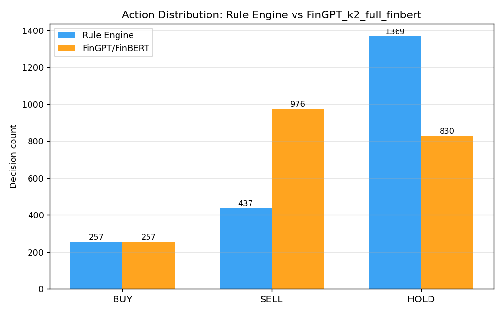
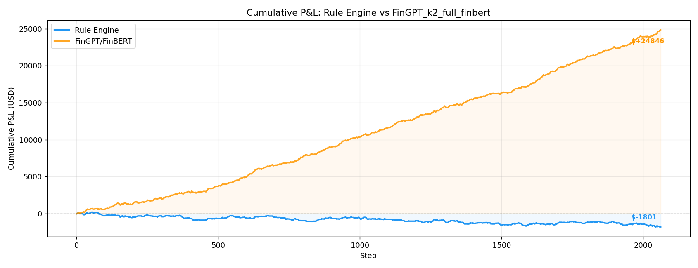
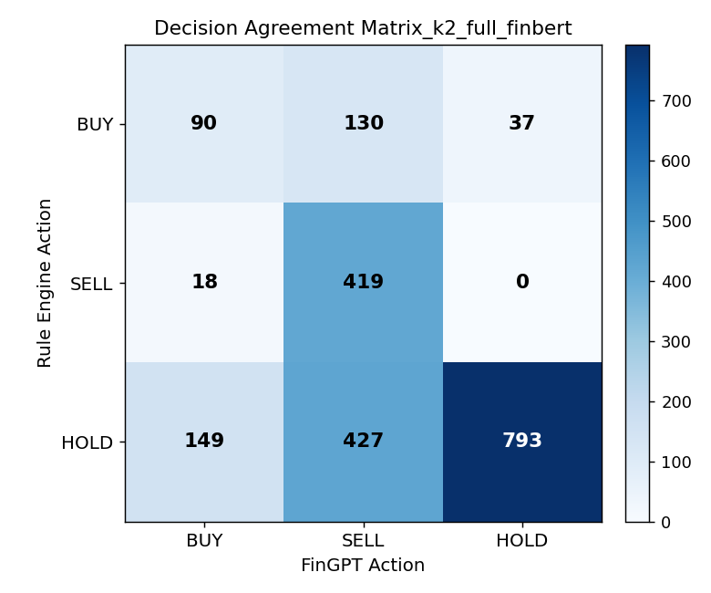
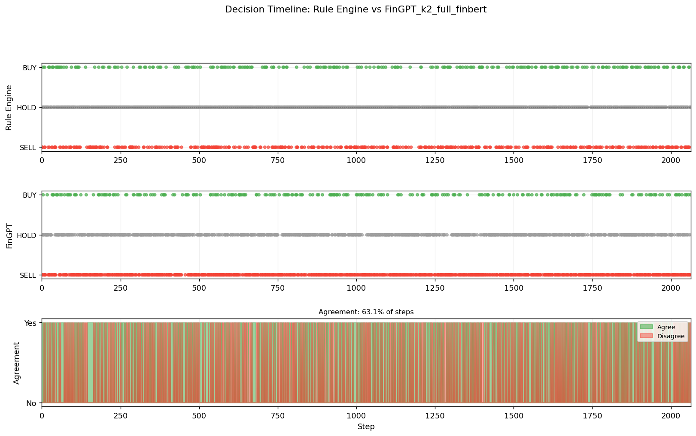

# Crypto Drift Guard

A framework for detecting and measuring **logic drift** in cryptocurrency trading agents. It runs two types of experiments:

- **Drift mode** — subjects a deterministic rule-based agent to data mutations and measures how much its behaviour changes (Action Difference Ratio)
- **Hybrid mode** — runs two agents in parallel (Rule Engine vs FinBERT) on the same data and measures consensus, disagreement, and comparative P&L

The goal is not to build a profitable trading strategy, but to observe *how* and *where* agents diverge under different conditions.

---

## Project Structure

```
crypto-drift-guard/
├── data/
│   └── crypto_sentiment_prediction_dataset.csv   # 2063 rows, 30-day crypto market data
├── outputs/                                       # Generated on each run (JSON, TXT, PNG)
├── src/
│   ├── main.py                                    # Entry point — drift / hybrid / all modes
│   ├── simulator.py                               # P&L engine ($1000 notional per trade)
│   ├── agents/
│   │   ├── rule_based_agent.py                    # Deterministic rule engine + risk oracle
│   │   └── fingpt_agent.py                        # FinBERT / heuristic agent
│   ├── analysis/
│   │   ├── reports.py                             # DriftReport, ConsensusReport, P&L table
│   │   └── plots.py                               # 4 comparison plots (PNG)
│   └── data/
│       └── data_ingestion.py                      # CSV loader + mutation operators
└── requirements.txt
```

### Key components

| Component | Role |
|---|---|
| `TradingAgent` | Stateless rule engine: sentiment + RSI thresholds, volatility oracle |
| `FinancialLLMAgent` | FinBERT (ML) or heuristic (weighted composite score) |
| `simulator.py` | Converts action trajectories to per-step and cumulative P&L |
| `compute_drift()` | Compares two Rule Engine trajectories — baseline vs mutant |
| `compute_consensus()` | Compares Rule Engine vs FinBERT trajectories |

---

## How to Run Locally

### 1. Install dependencies

```bash
pip install -r requirements.txt
```

> First run with `--backend finbert` will download `ProsusAI/finbert` (~440 MB) and cache it locally.

### 2. Run all experiments

```bash
# Full run — drift mode + hybrid mode (heuristic backend, fast)
python src/main.py

# Full run with FinBERT (ML, CPU-friendly)
python src/main.py --mode all --backend finbert

# Drift analysis only
python src/main.py --mode drift

# Hybrid comparison on a 100-row sample (quick test)
python src/main.py --mode hybrid --sample 100 --backend finbert
```

### CLI options

| Flag | Default | Description |
|---|---|---|
| `--mode` | `all` | `drift`, `hybrid`, or `all` |
| `--backend` | `heuristic` | `heuristic` (no ML) or `finbert` (local ~440 MB) |
| `--sample N` | full dataset | Limit hybrid mode to first N rows |

### 3. Outputs

All files are written to `outputs/`:

| Pattern | Description |
|---|---|
| `traj_*.json` | Per-step trajectory with actions, P&L, reasoning |
| `combined_log_*.json` | Side-by-side Rule + FinBERT log with agreement flag |
| `drift_report_*.txt` | ADR and oracle violation metrics |
| `consensus_report_*.txt` | Logic gap, policy gap, disagreement breakdown |
| `*_pnl_*.txt` | P&L comparison table |
| `plot_*.png` | Action distribution, P&L curves, agreement matrix, decision timeline |

---

## Analysis Report

> Results from: `python src/main.py --mode all --backend finbert`
> Dataset: 2063 rows, 2025-06-04 → 2025-07-04

### Agent Designs

**Rule Engine** (`rule_based_agent.py`)

| Signal | Condition | Action |
|---|---|---|
| Sentiment > 0.5 AND RSI < 70 | — | BUY |
| Sentiment < −0.3 OR RSI > 80 | — | SELL |
| Otherwise | — | HOLD |
| Volatility > 90 (oracle) | override any | HOLD |

**Heuristic agent** (`fingpt_agent.py`, `backend="heuristic"`)

Weighted composite: `0.50×sentiment + 0.25×rsi_signal + 0.15×momentum + 0.10×fear_greed`
- Composite > 0.30 → BUY, < −0.20 → SELL, else HOLD (softer thresholds, 4 signals vs 2)

**FinBERT agent** (`fingpt_agent.py`, `backend="finbert"`)

Constructs a natural-language sentence from the row's numerical fields and classifies it with `ProsusAI/finbert` (positive/negative/neutral → BUY/SELL/HOLD).

---

### Experiment 1 — Drift: Intensity Mutation (sentiment ×2.0)

```
Total steps       : 2063
Mismatched steps  : 398
ADR               : 19.29%
Oracle violations : 0  (0.00%)
```

| Agent | P&L | Trades | Win rate |
|---|---|---|---|
| Baseline (Rule Engine) | −$369.90 | 296 | 46.6% |
| Mutant (sentiment ×2.0) | −$1,801.30 | 694 | 47.8% |
| **Delta** | **−$1,431.40** | +398 | +1.2pp |

**Key findings:**
- Doubling sentiment pushes ~1 in 5 rows across the BUY threshold (`> 0.5`), causing the agent to over-trade (296 → 694 trades)
- More trades with a near-50% win rate compounds losses — the agent doesn't get smarter from stronger signals
- **Zero oracle violations** confirm the risk oracle is robust: every high-volatility row is correctly suppressed regardless of mutation

---

### Experiment 2 — Drift: Temporal Jitter (news_impact shifted 3 steps)

```
Total steps       : 2063
Mismatched steps  : 0
ADR               : 0.00%
Oracle violations : 0  (0.00%)
```

| Agent | P&L | Trades |
|---|---|---|
| Baseline | −$369.90 | 296 |
| Mutant (lagged news) | −$369.90 | 296 |

**Key finding:** The Rule Engine is completely invariant to this mutation because its policy only reads `social_sentiment_score` and `rsi_technical_indicator` — `news_impact_score` is never used. This reveals a silent dead feature in the dataset.

---

### Experiment 3 — Hybrid: Rule Engine vs FinBERT (full dataset, sentiment ×2.0)

```
=== Consensus & Gap Report ===
Total steps              : 2063

Logic Gap (post-oracle)  : 761   (36.89%)
Policy Gap (pre-oracle)  : 1197  (58.02%)
Oracle Override Rate     : 675   (32.72%)
```

**Action distributions:**

| Action | Rule Engine | FinBERT |
|---|---|---|
| BUY | 257 (12.5%) | 257 (12.5%) |
| SELL | 437 (21.2%) | 976 (47.3%) |
| HOLD | 1369 (66.3%) | 830 (40.2%) |

**P&L:**

| Agent | P&L | Trades | Win rate |
|---|---|---|---|
| Rule Engine | −$1,801.30 | 694 | 47.8% |
| FinBERT | +$24,846.20 | 1,233 | **74.6%** |
| **Delta** | **+$26,647.50** | — | — |

**Disagreement breakdown (Rule → FinBERT):**

| Transition | Count |
|---|---|
| HOLD → SELL | 427 |
| HOLD → BUY | 149 |
| BUY → SELL | 130 |
| BUY → HOLD | 37 |
| SELL → BUY | 18 |

**Key findings:**
- FinBERT is heavily SELL-biased (976 SELLs vs 437) — the dominant divergence is the 427 `HOLD→SELL` flips where FinBERT shorts positions the Rule Engine sits out
- The 58% policy gap pre-oracle is high; the oracle reduces this to 37% by collapsing many disagreements into mutual HOLDs (32.7% of all steps are oracle-overridden)
- BUY counts are identical (257) — both agents agree on when to go long but diverge sharply on when to go short

---

### Plots

**Action Distribution**



**Cumulative P&L Curves**



**Decision Agreement Matrix**



**Decision Timeline**



---

### Caveats

1. **FinBERT reads constructed text, not real news.** Its input is a sentence built from numerical fields (e.g. *"Algorand moved down 5.3% with positive social sentiment"*). The high win rate reflects pattern-matching on words like "moved down" rather than genuine financial understanding.

2. **74.6% win rate is abnormally high.** Real strategies rarely sustain above 55–60%. The dataset covers a single 30-day window and FinBERT's SELL bias happened to align with the market's direction during that period.

3. **No transaction costs.** The simulator assumes zero friction. FinBERT's 1,233 trades vs the Rule Engine's 694 would incur significantly more cost in practice.

4. **No out-of-sample validation.** All evaluation is in-sample on the same 2063 rows used to develop the system.
