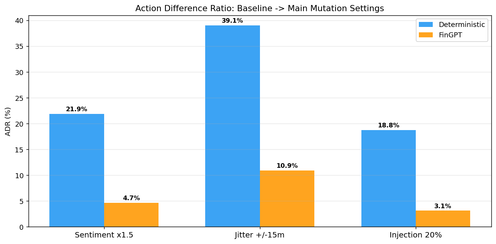
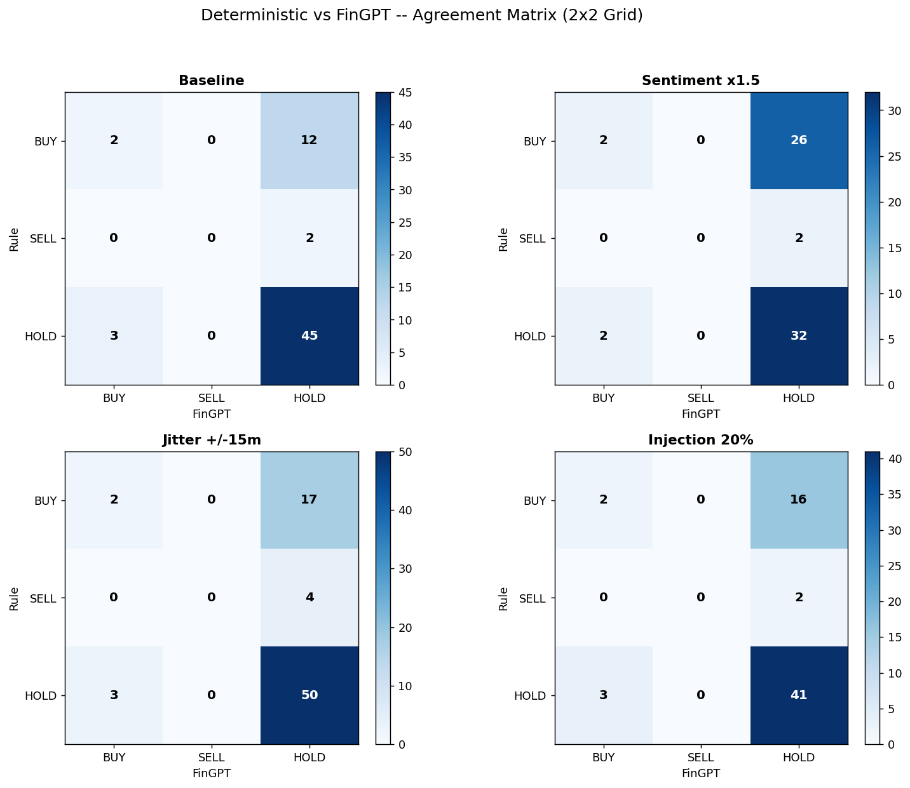

# Crypto Drift Guard

Crypto Drift Guard is a notebook-first CS527 project for measuring how cryptocurrency trading-agent decisions drift when tweet-derived sentiment data is mutated.

The final deliverable is [`notebooks/notebook.ipynb`](notebooks/notebook.ipynb). Earlier Python package and CLI work is still kept in the repository for provenance, but the notebook and `data/` folder are the canonical materials for review.

## Final Entry Point

Open and run:

```text
notebooks/notebook.ipynb
```

The notebook contains the complete final workflow:

| Layer | Purpose | Main outputs |
|---|---|---|
| Layer 1 | Clean Crypto10K tweets, score BTC/ETH tweets with FinBERT, and generate mutation sweeps | `data/layer1_outputs/` |
| Layer 2 | Run deterministic and FinGPT-style trading agents on baseline and mutated window data | generated trajectories under `data/layer2_outputs/` when rerun |
| Layer 3 | Compute drift, consensus, prompt-ablation snapshots, sweep sensitivity tables, and plots | `data/layer3_outputs/` |

The goal is not to build a profitable trading strategy. The project measures where deterministic and LLM-based trading decisions diverge under sentiment amplification, temporal jitter, and adversarial tweet injection.

## Repository Structure

```text
crypto-drift-guard/
├── notebooks/
│   └── notebook.ipynb                    # final notebook and primary project entry point
├── data/
│   ├── crypto_10k_tweets_(2021_2022Nov).csv
│   ├── CS527_Project_Proposal.pdf
│   ├── layer1_outputs/                   # cleaned, FinBERT-scored, and mutated tweet datasets
│   ├── layer2_outputs/                   # optional/generated trajectories when rerunning Layer 2
│   └── layer3_outputs/                   # final plots and summary tables used by the notebook
├── src/                                  # legacy CLI implementation kept for provenance
├── outputs/                              # legacy CLI run outputs kept for provenance
├── requirements.txt
└── README.md
```

### Canonical Data and Results

Use `data/` as the source of truth for the final notebook workflow:

| Path | Role |
|---|---|
| `data/crypto_10k_tweets_(2021_2022Nov).csv` | Raw Crypto10K tweet dataset currently stored in this repository |
| `data/layer1_outputs/` | Final Layer 1 datasets: cleaned BTC/ETH tweets, FinBERT scores, mutation sweeps, and target-window reports |
| `data/layer2_outputs/` | Generated Layer 2 trajectory location; this folder may be empty in the committed repo and is recreated when the notebook is rerun |
| `data/layer3_outputs/tables/` | Final CSV summaries for ADR, consensus, injection sensitivity, and prompt ablation |
| `data/layer3_outputs/plots/` | Final visualization files used by the notebook/report |

Important final result files include:

- `data/layer3_outputs/tables/adr_table.csv`
- `data/layer3_outputs/tables/consensus_table.csv`
- `data/layer3_outputs/tables/sweep_adr_table.csv`
- `data/layer3_outputs/tables/sweep_consensus_table.csv`
- `data/layer3_outputs/tables/injection_flip_table.csv`
- `data/layer3_outputs/tables/prompt_ablation_summary.csv`

## How to Run

### 1. Install dependencies

```bash
pip install -r requirements.txt
```

The notebook also installs or imports additional model-runtime packages in Colab cells when needed, such as `transformers`, `peft`, `bitsandbytes`, and `accelerate`.

### 2. Open the notebook

Use Jupyter or Google Colab:

```bash
jupyter notebook notebooks/notebook.ipynb
```

Then run the notebook from top to bottom. The checked-in outputs under `data/layer1_outputs/` and `data/layer3_outputs/` let readers inspect the final generated artifacts without rerunning every model-heavy cell.

### 3. Check the raw-data path before rerunning

The current notebook was developed with a Colab-style path:

```text
data/raw/crypto_10k_tweets_(2021_2022Nov).csv
```

In this repository, the raw CSV is currently stored at:

```text
data/crypto_10k_tweets_(2021_2022Nov).csv
```

Before rerunning Layer 1 from scratch, either update `RAW_PATH` in the notebook to the repository path above or place a copy/symlink of the CSV under `data/raw/`.

## Final Outputs

The notebook writes final figures and tables under `data/layer3_outputs/`.

| Output | File |
|---|---|
| ADR comparison | `data/layer3_outputs/plots/l3_adr_comparison.png` |
| Rule vs FinGPT agreement matrix | `data/layer3_outputs/plots/l3_agreement_matrix_grid.png` |
| Action distribution by main mutation | `data/layer3_outputs/plots/l3_action_distribution_vertical.png` |
| Adversarial flip analysis | `data/layer3_outputs/plots/l3_adversarial_flip.png` |
| Sweep ADR table | `data/layer3_outputs/tables/sweep_adr_table.csv` |
| Sweep consensus table | `data/layer3_outputs/tables/sweep_consensus_table.csv` |





## Reproducibility Notes

- FinBERT scoring may download `ProsusAI/finbert` and can take time on CPU.
- FinGPT-style inference cells are designed for Colab/GPU execution and may require model downloads plus GPU-compatible package versions.
- Some Layer 3 plots and tables depend on recorded prompt-ablation outputs; the notebook marks those as static snapshots instead of rerunning the full ablation each time.
- Rerunning all cells may overwrite files under `data/layer1_outputs/`, `data/layer2_outputs/`, and `data/layer3_outputs/`.

## Legacy Materials

The folders below are intentionally retained but are not the final project entry point:

| Path | Status |
|---|---|
| `src/` | Earlier Python CLI implementation with agents, simulator, reports, and plotting helpers |
| `outputs/` | Results generated by the earlier CLI workflow |

These files are useful for tracing earlier development decisions and comparing against the final notebook implementation. Reviewers should treat `notebooks/notebook.ipynb` and `data/` as the final submission materials.
